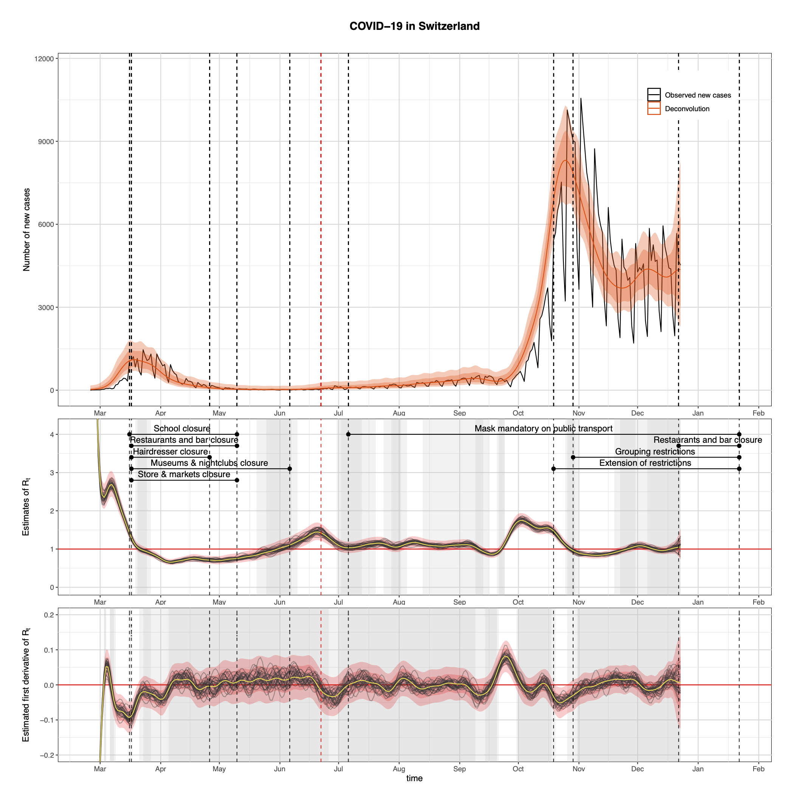
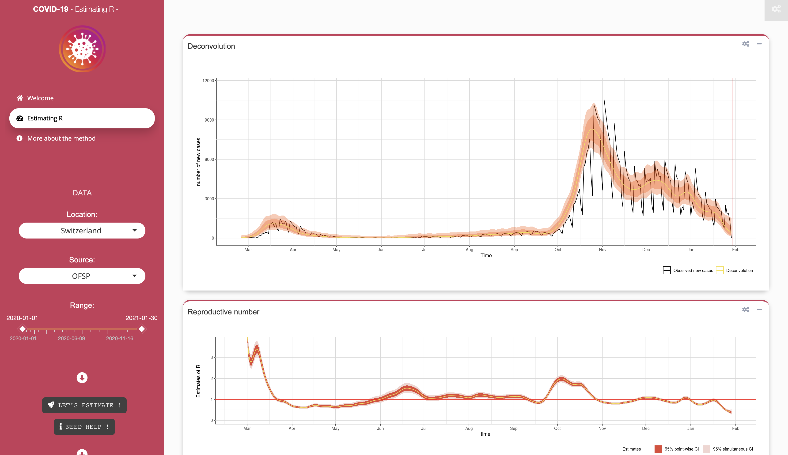
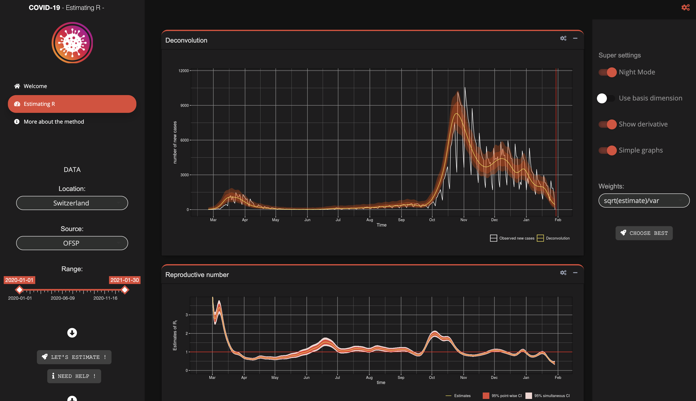

# Estimating the reproductive number of the COVID-19 epidemic in Switzerland

Estimates of the reproduction number Rt are of great interest in monitoring the course of an epidemic and potential changes in disease transmission. The COVID-19 pandemic has evolved rapidly and has been monitored by state authorities to understand how health measures such as home quarantine and social distancing can contain the outbreak. The use of Cori et al. estimation method of Rt has proven to be very effective, and we propose and discuss in this report two alternative approaches, one based on the generation interval, the other on the epidemiological SIR model. In both methods, Rt is modeled as a smooth function of time through the use of generalized additive models. We also provide methods to retrieve the actual incidence events from the observed curve of new daily cases, given an incubation period. These methods prove their value both on smooth data and on data with strong weekly patterns.
We estimate Rt for CODID-19 in Switzerland from March to the end of December 2020, and evaluate the effectiveness of health measures. 

  

## Project structure

In the Code folder, you will find the following files:
- _Simulation.R_: functions to generate synthetic data and epidemiological curves
- _Deconvolution.R_ : functions to estimate true incidence events from observed incidence curve.
- _EstimatingRt.R_: functions to estimate the reproductive number Rt, using smoothing splines. This includes estimates using the generation intervals and also the method based on the SIR model.
- _DataGeneration.R_: results obtained on the synthetic dataset, both for the deconvolution and for estimating Rt.
- _covid19.R_: estimating the reproductive number of the COVID-19 epidemic in Switzerland.
- _HTML_: folder that contains a small recap of the COVID-19 epidemic in Switzerland with code and figures in html format, along with an R Markdown file.

## Shiny App

A [Shiny App](https://antoinestats.shinyapps.io/ShinyAppCOVID19/) was also developped to estimate the true incidence curve and the reproductive number online, for some available countries. This app allows the user to change the incubation period and generation intervals, as well as some settings of the used methods.
Here are some pictures of the app in action.

  

  

## Credits

[Antoine Bourret](<antoine.bourret@epfl.ch>)
